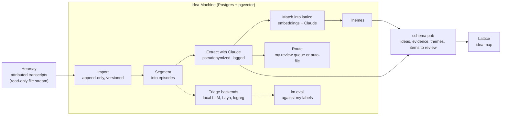

# Idea Machine

Turns transcripts of my recorded conversations into a searchable map of the ideas in them.

Idea Machine reads the speaker-attributed transcripts that [Hearsay](https://github.com/junglestyle/hearsay)
makes from conversations recorded with consent. It groups them into episodes, has Claude pull out ideas,
jokes, tasks and decisions with quotes and line citations, and links each idea to similar ones it has seen
before. [Lattice](https://github.com/junglestyle/lattice) shows the result. Most recorded speech is small
talk, so most of the work is deciding what deserves attention, and measuring whether a cheap model can
decide that before trusting it to.

## The interesting parts

- **Triage backends are measured before they are trusted.** I label episodes by hand (`im label`). `im eval`
  scores each backend on four questions (kind, project, keep 1-5, "am I thinking aloud") against those labels:
  accuracy, points of lift over always answering the most common label, and a reliability table of accuracy
  per confidence bucket. The logistic-regression baseline (over local `bge-small` embeddings) is scored by
  5-fold cross-validation; the local LLM (`gpt-oss:20b` via Ollama) and Laya (a small decision model) are
  scored on their stored answers, then again after temperature scaling fitted on held-out folds. The router
  is scored separately: for each reason it sends an episode to review, the share I judged worth keeping.
- **The eval changed the design.** On the first 52 labels nothing beat the base rates, except the LLM on
  project (54% vs 33%), and the LLM's review flags were mostly false alarms. So no triage output drives
  routing: Claude reads every episode, and the triage backends stay available for `im eval`.
  See [decisions 0002](docs/decisions/0002-first-triage-eval.md) and [0004](docs/decisions/0004-claude-extraction.md).
- **Everything derived can be rebuilt.** Episodes are content-addressed (`uuid5` of the heuristic version and
  input hash), so a transcript correction re-derives only the episodes it touches. Every derived row records
  the code, model and prompt version that produced it, and `im reset --stage X` drops a stage to rebuild.
  Hand labels are anchored to transcript segments, so they survive re-segmentation. When Hearsay forgets a span,
  the episodes, labels and captured ideas built from it are deleted here too.
- **What leaves the box is a versioned policy.** Speakers are pseudonymized per request (`me`, `S1`, `S2`),
  and the mapping stays local. Every Claude request is logged with the segment IDs it carried, its tokens
  and cost, and a monthly budget is checked before each one.
- **A plain data contract on both sides.** Idea Machine reads Hearsay's file stream read-only, and Lattice
  reads only the views in schema `pub`, so each app can change without touching the others' internals.

## Stack

Python 3.13, uv, Postgres 16 + pgvector, Claude (Anthropic SDK), sentence-transformers, scikit-learn,
Ollama and Laya for triage experiments, Docker on TrueNAS.

## Running it

Setup, commands and configuration: [docs/install.md](docs/install.md). Deploying to the NAS:
[docs/deploy.md](docs/deploy.md).

## Status

Single-user; runs hourly on a home NAS; 89 tests (pytest, against a throwaway Postgres); roadmap in
[docs/ROADMAP.md](docs/ROADMAP.md).
